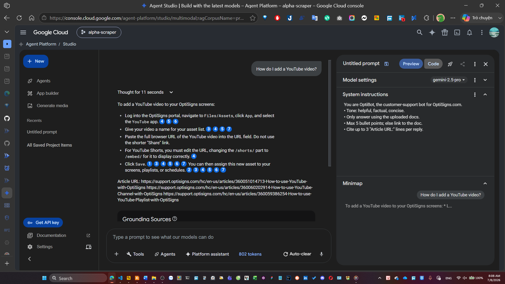

# OptiSigns - OptiBot Mini-Clone Daily Sync Job

This repository implements a Dockerized daily pipeline that scrapes support articles from `support.optisigns.com`, converts them to Markdown, and synchronizes the files to Google Cloud Storage (GCS) and a Google Vertex AI RAG Corpus. Only delta changes (new, updated, or deleted articles) are synchronized.

---

## 1. Setup Instructions

Perform these steps inside your WSL / Linux terminal:

### Step 1: Create and Activate Virtual Environment
```bash
python3 -m venv venv_alpha
source venv_alpha/bin/activate
```

### Step 2: Install Dependencies
```bash
pip install -r requirements.txt
```

### Step 3: Configure Environment Variables & Keys
1. Copy `.env.sample` to `.env`:
   ```bash
   cp .env.sample .env
   ```
2. Populate `.env` with your GCP details:
   * `GCS_BUCKET_NAME`: Name of your GCS bucket.
   * `GCP_PROJECT_ID`: Your GCP Project ID (e.g. `alpha-scraper-501706`).
   * `VERTEX_CORPUS_ID`: Your Vertex AI RAG Corpus ID.
3. Place your Google Cloud service account JSON key in the root directory and name it `gcp-key.json` (ignored by Git).

---

## 2. How to Run Locally

### Run the Entire Pipeline
To scrape and synchronize the delta to GCS & Vertex AI RAG:
```bash
python main.py
```

### Run Scraper Separately
To scrape and output Markdown files to the local `./articles` folder only:
```bash
python scraper.py
```

---

## 3. How to Run with Docker & Deploy

### Run Locally with Docker
1. Build the image:
   ```bash
   docker build -t optisigns-scraper .
   ```
2. Run the container:
   ```bash
   docker run --env-file .env -v $(pwd)/gcp-key.json:/app/gcp-key.json optisigns-scraper
   ```

### Deploy to Google Cloud Run Jobs

1. Authenticate Docker with Google Artifact Registry:
   ```bash
   gcloud auth print-access-token | docker login -u oauth2accesstoken --password-stdin https://us-central1-docker.pkg.dev
   ```

2. Build and Tag the Image:
   ```bash
   docker build -t us-central1-docker.pkg.dev/alpha-scraper-501706/optibot-repo/optibot-scraper:latest .
   ```

3. Push the Image to Artifact Registry:
   ```bash
   docker push us-central1-docker.pkg.dev/alpha-scraper-501706/optibot-repo/optibot-scraper:latest
   ```

4. Update the Cloud Run Job:
   ```bash
   gcloud run jobs update optibot-scraper-daily \
     --image us-central1-docker.pkg.dev/alpha-scraper-501706/optibot-repo/optibot-scraper:latest \
     --region us-central1
   ```

5. Execute the Cloud Run Job:
   ```bash
   gcloud run jobs execute optibot-scraper-daily --region us-central1
   ```

---

## 4. Chunking Strategy

* **Chunk Size**: 1024 tokens.
* **Chunk Overlap**: 256 tokens.
* **Rationale**: Markdown files utilize headings and code blocks. Using 1024 tokens preserves semantic structures (e.g. lists, steps, and paragraphs) in single chunks. The 256-token overlap ensures contextual transitions between sections are retained.

---

## 5. Daily Job Logs

The execution logs can be accessed via:
* **GCP Cloud Run Job Logs**: [GCP Console Link](https://console.cloud.google.com/run/jobs/details/us-central1/optibot-scraper-daily/executions?project=alpha-scraper-501706) (requires project viewer permissions)
* **Local Run Log Artifact**: [View last run log file](./last_run_log.txt) (fallback for immediate public viewing)

---

## 6. Assistant Sanity Check Screenshot

Below is the verification screenshot showing the assistant answering the sample question "How do I add a YouTube video?" with cited URLs:




